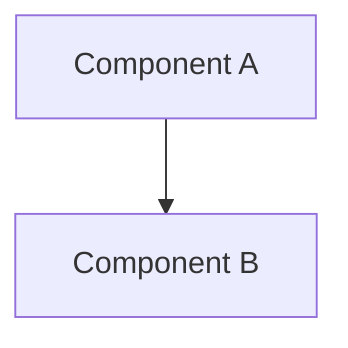
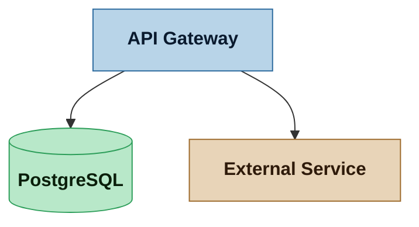

# Skill — Mermaid Diagrams

Architectural and structural diagrams are authored in **Mermaid syntax** — never in ASCII art. This skill defines when and how to produce Mermaid diagrams in Nexus SDLC artifacts.

---

## Why Mermaid, not ASCII

- **Unambiguous.** Mermaid is a structured grammar — a node is a node, an edge is an edge. ASCII boxes and arrows are visually suggestive but syntactically meaningless.
- **Renderable.** GitHub, Starlight, and most markdown renderers display Mermaid natively. ASCII art requires a monospace font and breaks in proportional contexts.
- **Version-controllable.** Diffs on Mermaid source are meaningful. Diffs on ASCII art are noise.
- **Maintainable.** Adding a node to a Mermaid graph is a one-line change. Adding a box to an ASCII diagram may require re-aligning every surrounding line.

---

## When to use Mermaid

Use a Mermaid diagram whenever a relationship, flow, or structure would otherwise be described in prose or drawn in ASCII. Common cases:

| Diagram type | Mermaid chart type | Typical agent |
|---|---|---|
| Component map | `flowchart` or `graph` | Architect |
| Deployment diagram | `flowchart` | Architect |
| Data flow | `flowchart` | Architect |
| Sequence / interaction | `sequenceDiagram` | Architect, Designer |
| Domain model / ER | `erDiagram` | Analyst (Critical+) |
| State machine | `stateDiagram-v2` | Designer, Architect |
| Dependency graph | `flowchart` | Planner |
| Timeline / Gantt | `gantt` | Planner |

---

## Conventions

### Fenced blocks

Always wrap Mermaid in a fenced code block with the `mermaid` language tag:

````

````

### Style classes

When diagram clarity benefits from color-coding, define `classDef` styles at the top and apply them. Use semantic names (`external`, `internal`, `datastore`, `boundary`), not colors (`blue`, `red`).



### Node labels

- Use descriptive labels, not single letters: `API["API Gateway"]` not `A`
- For multi-line labels, use `<br/>` — not literal newlines
- Wrap labels in quotes when they contain special characters

### Diagram size

Keep diagrams focused. If a single diagram has more than ~15 nodes, consider splitting it into sub-diagrams by concern (e.g., one for the data layer, one for the API layer). Reference the sub-diagrams from a top-level overview diagram.

---

## What Mermaid does NOT replace

- **Trade-off matrices** — these are tables, not diagrams
- **Prose rationale** — a diagram shows structure, not reasoning
- **Wireframes** — screen layout is a Designer concern (Stitch for GUI, ASCII notation for TUI)
- **Code** — Mermaid describes architecture, not implementation
