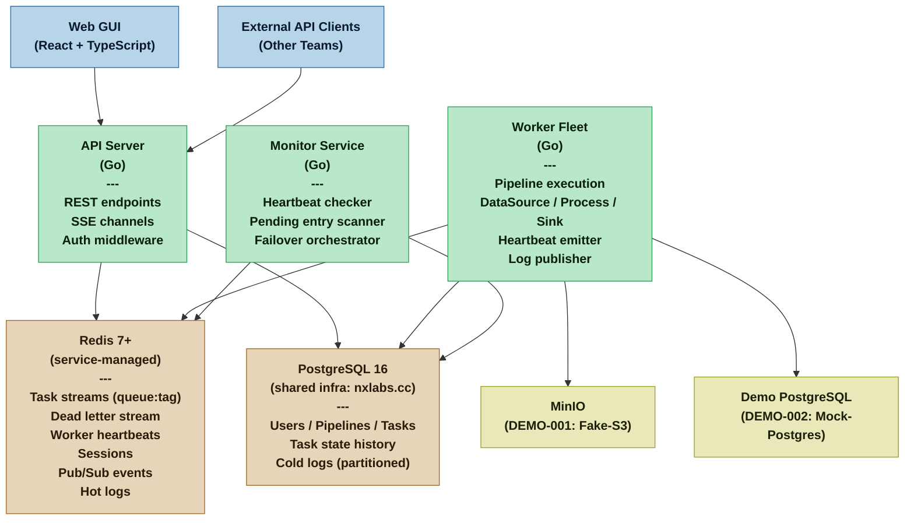
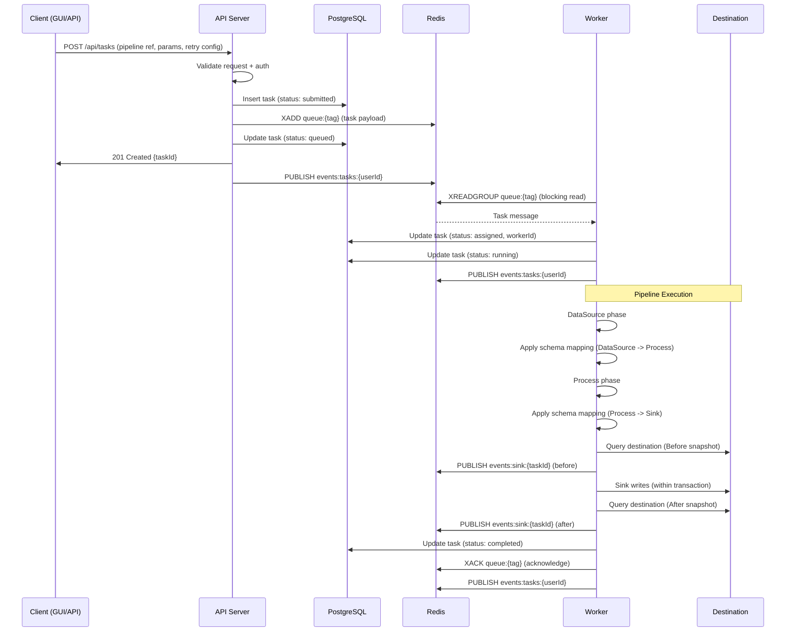
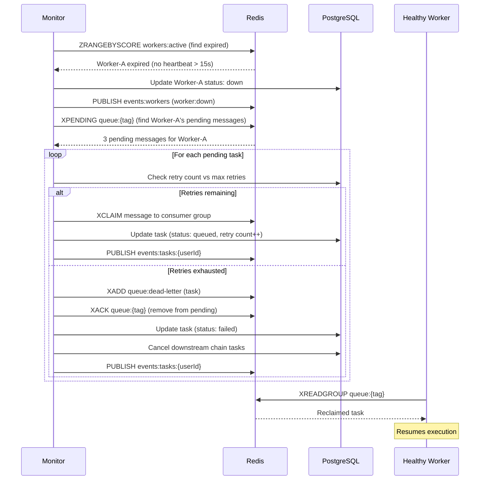
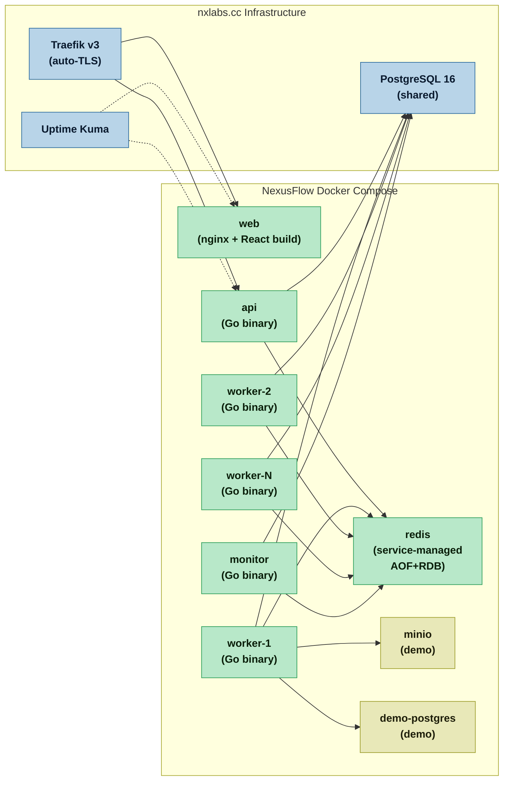

# System Architecture -- NexusFlow
**Version:** 2 | **Date:** 2026-03-26 | **Profile:** Critical
**Revision:** Go backend + nxlabs.cc deployment (Nexus-directed changes at Architecture Gate)

## System Metaphor

NexusFlow is a **post office with self-organizing mail carriers** -- requests arrive at the front desk (Producer API), are sorted into labeled mailbags (Redis Streams per capability tag), and mail carriers (Workers) pick up bags matching their routes. A supervisor (Monitor) watches for carriers who do not check in and reassigns their undelivered mail. A tracking board (Web GUI) shows every package's journey in real time.

---

## Component Map

### Component Responsibilities

| Component | Owns | Exposes |
|---|---|---|
| **API Server** | User authentication (ADR-006); pipeline CRUD (REQ-022); task submission and validation (REQ-001); task state management (REQ-009, REQ-010); SSE event distribution (ADR-007); stream routing (ADR-001) | REST API (all endpoints); SSE channels (tasks, workers, logs, sink) |
| **Worker** | Pipeline execution -- DataSource, Process, Sink (REQ-006); schema mapping application (REQ-007); Sink atomicity (REQ-008, ADR-009); heartbeat emission (REQ-004); log production (REQ-018); Sink snapshot capture (DEMO-003) | Heartbeat to Redis; log lines to Redis Pub/Sub; task completion/failure to Redis |
| **Monitor** | Heartbeat timeout detection (REQ-004, ADR-002); pending entry scanning and XCLAIM (REQ-013, ADR-002); retry counting and dead-letter routing (REQ-011, REQ-012); cascading cancellation (REQ-012) | Worker status events to Redis Pub/Sub; failover actions via XCLAIM |
| **Redis** | Task queue streams (ADR-001); consumer group coordination; session storage (ADR-006); Pub/Sub event distribution (ADR-007); hot log storage (ADR-008) | Stream and Pub/Sub APIs consumed by API, Worker, and Monitor |
| **PostgreSQL** | Persistent relational data: users, pipelines, chains, tasks, state history, cold logs (ADR-008) | SQL API consumed by API Server and Worker |
| **Web GUI** | Pipeline Builder (REQ-015); Worker Fleet Dashboard (REQ-016); Task Feed (REQ-017); Log Streamer (REQ-018); Sink Inspector (DEMO-003); Chaos Controller (DEMO-004) | Browser-rendered interface consuming REST API and SSE channels |

---

## Data Flow

### Task Submission and Execution

### Failover Flow

---

## Deployment Model

See ADR-005 for full rationale. Deploys to nxlabs.cc (187.124.233.130) with Traefik, Watchtower, and shared PostgreSQL.

- **Environments:** dev (localhost), staging (`nexusflow.staging.nxlabs.cc`), production (`nexusflow.nxlabs.cc`)
- **Scaling:** `docker compose up --scale worker=N` for manual fleet sizing
- **CI trigger:** Commit to `main` -- build + test
- **Staging trigger:** `demo/vN.N` tag -- build + push images; Watchtower auto-deploys
- **Production trigger:** `release/vN.N` tag -- retag staging image as `latest`; Watchtower auto-deploys
- **Health endpoints:** `GET /api/health` on API; heartbeat-based for workers; Uptime Kuma monitors externally
- **Auto-updates:** Watchtower polls registry every 5 min; rolling restarts on new images

---

## Technology Stack Summary

| Layer | Technology | ADR |
|---|---|---|
| Backend runtime | Go (stdlib net/http + chi/echo router) | ADR-004 |
| Frontend framework | React + TypeScript | ADR-004 |
| Task queue | Redis Streams with consumer groups | ADR-001 |
| Relational data | PostgreSQL 16 (shared infra) + pgx driver + sqlc | ADR-004, ADR-008 |
| Schema migration | golang-migrate (plain SQL migrations) | ADR-008 |
| Authentication | Server-side sessions in Redis (bcrypt passwords) | ADR-006 |
| Real-time updates | SSE with Redis Pub/Sub distribution | ADR-007 |
| Containerization | Docker Compose on nxlabs.cc | ADR-005 |
| Reverse proxy | Traefik v3 (auto-TLS via Let's Encrypt) | ADR-005 |
| Auto-deployment | Watchtower (registry polling) | ADR-005 |
| Monitoring | Uptime Kuma + AutoKuma (health checks) | ADR-005 |
| Queue semantics | At-least-once with idempotency guards | ADR-003 |
| Persistence | Redis AOF+RDB hybrid (service-managed); PostgreSQL for relational data | ADR-001, ADR-008 |
| API contract | OpenAPI spec; TypeScript types generated for frontend | ADR-004 |
| Redis client | go-redis | ADR-004 |
| PostgreSQL driver | pgx | ADR-004 |

---

## Integration Points

| Integration | Protocol | Direction | Owner |
|---|---|---|---|
| External API clients -> API Server | REST (HTTP/JSON) | Inbound | API Server |
| Web GUI -> API Server | REST + SSE (HTTP) | Inbound | API Server |
| API Server -> Redis | Redis protocol (go-redis) | Internal | API Server |
| API Server -> PostgreSQL | PostgreSQL protocol (pgx) | Internal | API Server |
| Worker -> Redis | Redis protocol (go-redis) | Internal | Worker |
| Worker -> PostgreSQL | PostgreSQL protocol (pgx) | Internal | Worker |
| Worker -> Sink destinations | Destination-specific (S3 API, SQL, file I/O) | Outbound | Worker |
| Worker -> DataSource origins | Origin-specific (S3 API, SQL, HTTP) | Inbound (to worker) | Worker |
| Monitor -> Redis | Redis protocol (go-redis) | Internal | Monitor |
| Monitor -> PostgreSQL | PostgreSQL protocol (pgx) | Internal | Monitor |
| Traefik -> API Server | HTTP reverse proxy | Infrastructure | Traefik |
| Traefik -> Web Server | HTTP reverse proxy | Infrastructure | Traefik |
| Uptime Kuma -> API/Web | HTTP health check | Infrastructure | Uptime Kuma |

---

## Key Architectural Decisions Summary

| # | Decision | ADR | Door type |
|---|---|---|---|
| 1 | Redis Streams with consumer groups, per-tag queue topology, AOF+RDB persistence | ADR-001 | Stream structure: One-way; Persistence: Two-way |
| 2 | Heartbeat polling (5s interval, 15s timeout) + XPENDING/XCLAIM scanner (10s interval) | ADR-002 | Two-way (configurable) |
| 3 | At-least-once delivery with idempotency guards at Sink boundary | ADR-003 | One-way |
| 4 | Go backend + React/TypeScript frontend + pgx/sqlc + go-redis | ADR-004 | One-way (Critical) |
| 5 | Docker Compose on nxlabs.cc; Traefik routing; Watchtower auto-deploy; shared PostgreSQL; service-managed Redis | ADR-005 | Two-way |
| 6 | Server-side Redis sessions; bcrypt passwords; HTTP-only cookies + Bearer tokens | ADR-006 | Two-way |
| 7 | SSE per-view channels with Redis Pub/Sub event distribution | ADR-007 | Two-way |
| 8 | golang-migrate + sqlc; dual log storage (Redis hot / PostgreSQL cold, 30-day retention); design-time + runtime schema mapping validation | ADR-008 | Retention: Two-way; Validation approach: One-way |
| 9 | Sink-type-specific transaction wrappers; pre-execution snapshot for Sink Inspector | ADR-009 | Atomicity: One-way; Snapshot: Two-way |

---

## Audit Deferral Resolutions

### AUDIT-005: Log Retention Policy
**Resolved in:** ADR-008
**Decision:** 72-hour hot retention in Redis Streams; 30-day cold retention in PostgreSQL with weekly partition pruning. Both durations are configurable per deployment.

### AUDIT-007: Schema Mapping Validation Timing
**Resolved in:** ADR-008
**Decision:** Both design-time and runtime validation. Design-time validation checks schema mappings against declared phase output schemas when a pipeline is saved. Runtime validation re-checks against actual output data during execution. REQ-007's runtime behavior is supplemented, not replaced.

### AUDIT-009: Sink Inspector "Before" State Capture
**Resolved in:** ADR-009
**Decision:** Pre-execution snapshot. Before the Sink phase begins, the worker queries the destination to capture current state within the Sink's output scope. The snapshot is stored as JSON in the task execution record and published via SSE for the Sink Inspector to display as a Before/After comparison.

---

## Deferred Decisions

| Decision | Why deferred | Resolve by | Risk of deferral |
|---|---|---|---|
| AUDIT-006: Pipeline template sharing | Not required for v1; additive feature; current private-ownership model is safe default | Before Cycle 2 planning | Low -- adding sharing later does not invalidate private ownership |
| Priority queuing | No requirement specifies priority; FIFO within tag streams is sufficient | When priority requirements surface | Low -- can add priority via multiple streams per tag |
| Worker auto-scaling | Explicitly out of scope (Brief); manual `--scale` is sufficient for stated scale | If scale requirements exceed manual management | Low -- containerized workers support any orchestrator |
| Rate limiting on API | Not in current requirements; single-org deployment with authenticated users | When external API usage patterns are understood | Medium -- should be addressed before production exposure to untrusted clients |

---

## Resource Topology

| Component | Resource | Operations |
|---|---|---|
| API Server | User | Read, write (admin CRUD: REQ-019, REQ-020) |
| API Server | Pipeline | Read, write (CRUD: REQ-022, REQ-023) |
| API Server | PipelineChain | Read, write (chain definition: REQ-014) |
| API Server | Task | Read, write (submission: REQ-001, REQ-002; cancellation: REQ-010; state query: REQ-009) |
| API Server | Worker | Read (fleet status: REQ-016) |
| API Server | TaskLog | Read (log query and streaming: REQ-018) |
| API Server | Auth/Session | Read, write (login/logout: ADR-006) |
| Worker | Task | Write (state transitions during execution: REQ-006, REQ-009) |
| Worker | TaskLog | Write (log production: REQ-018) |
| Monitor | Task | Write (failover state transitions: REQ-013; dead-letter routing: REQ-012) |
| Monitor | Worker | Read, write (heartbeat checking, status updates: REQ-004) |
