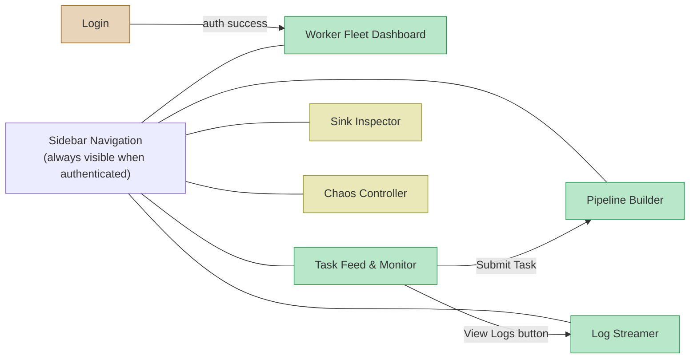
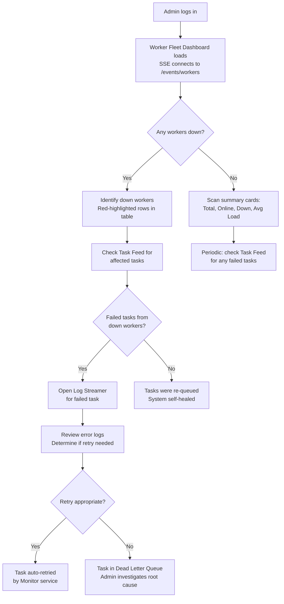
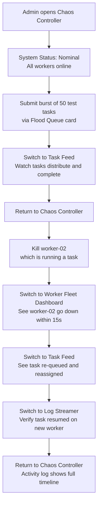
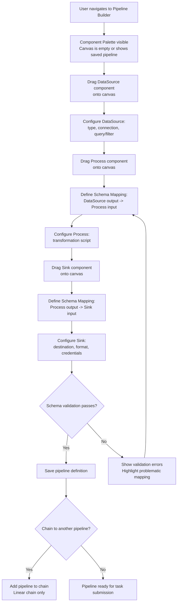
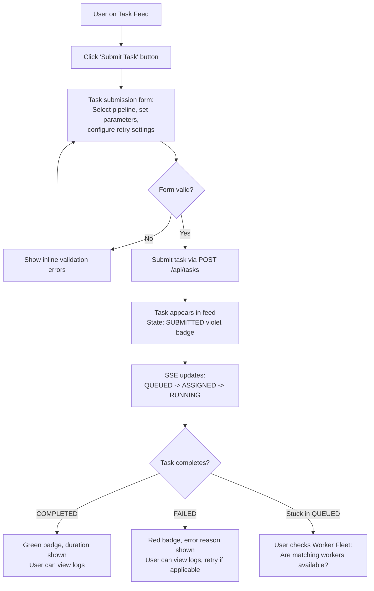

# UX Specification -- NexusFlow
**Version:** 1 | **Date:** 2026-03-26
**Delivery Channel:** Web App (React + TypeScript SPA via Traefik)
**Artifact Weight:** Blueprint
**Profile:** Critical

---

## Personas

### Admin
**Based on:** Brief -- User Roles: Admin
**Goals:** Maintain system health across all teams. Detect and resolve worker failures quickly. Monitor task throughput and identify bottlenecks. Manage user accounts for team members. Demonstrate system resilience during reviews.
**Behaviors:** Checks the Worker Fleet Dashboard first thing and after any incident alert. Keeps the Task Feed open in a browser tab throughout the workday. Switches to Log Streamer to diagnose failures. Uses Chaos Controller during scheduled demo sessions to prove auto-recovery. Scans for failed tasks and down workers as the primary health signal.
**Frustrations:** Stale dashboards that require manual refresh. Ambiguity about whether a worker is "slow" vs. "down." Log output that does not clearly indicate which pipeline phase produced an error. Having to switch between multiple tools to get a complete picture of a task's lifecycle.
**Context of use:** Desktop browser (Chrome/Firefox), 1920x1080 or higher resolution, multiple tabs open simultaneously. Office environment during business hours, but may check remotely during on-call rotations.
**Research basis:** Informed assumption based on the Brief's description of Admin responsibilities, the single-organization deployment model, and the portfolio project context. Admin behavior patterns modeled on common DevOps/SRE dashboard usage.

### User
**Based on:** Brief -- User Roles: User
**Goals:** Define pipelines that correctly transform and route data. Submit tasks and confirm they complete successfully. Diagnose failures in their own tasks by reading logs. Cancel tasks that are no longer needed. Build confidence that the system is processing their work reliably.
**Behaviors:** Uses the Pipeline Builder when setting up a new data flow (infrequent, design-time activity). Checks Task Feed regularly to verify task completion. Opens Log Streamer when a task fails or takes longer than expected. Rarely visits Worker Fleet Dashboard but may check it to understand why a task is queued for a long time (no matching workers).
**Frustrations:** Schema mapping errors that are only caught at runtime, not at design time. Not knowing why a task is stuck in "queued" state (is it a missing capability tag? no workers online?). Log output that does not clearly separate phases. Losing work on a pipeline definition due to a navigation accident.
**Context of use:** Desktop browser, standard office setup. Pipeline building is a focused task requiring screen real estate. Task monitoring is a background activity checked periodically.
**Research basis:** Informed assumption based on Brief's user role description and the pipeline linearity constraint (Phase 1). User behavior modeled on common ETL/data engineering workflows.

---

## Information Architecture

### Screen Inventory

| Screen | Purpose | Accessible to | Route | Requirements |
|---|---|---|---|---|
| Login | Authenticate users, establish session | Unauthenticated | `/login` | REQ-019 |
| Pipeline Builder | Visual drag-and-drop pipeline construction with schema mapping editor | Admin, User | `/pipelines` | REQ-015, REQ-007, REQ-014 |
| Worker Fleet Dashboard | Real-time view of all registered workers, their status, tags, and assignments | Admin, User | `/workers` | REQ-016, REQ-004 |
| Task Feed and Monitor | Real-time task lifecycle feed with filtering, submission, and cancellation | Admin (all tasks), User (own tasks) | `/tasks` | REQ-017, REQ-002, REQ-009, REQ-010 |
| Log Streamer | Real-time log output for a specific task with phase filtering | Admin (any task), User (own tasks) | `/tasks/{id}/logs` | REQ-018 |
| Sink Inspector | Before/after comparison of sink destination state (demo) | Admin | `/demo/sink-inspector` | DEMO-003 |
| Chaos Controller | Disturbance injection panel for resilience demos | Admin | `/demo/chaos` | DEMO-004 |

### Navigation Structure



**Navigation design decisions:**

1. **Sidebar navigation** is always visible on all authenticated views. It provides single-click access to any primary view. This follows the convention of operational dashboards (Grafana, Datadog, AWS Console) where users need to switch views frequently without losing context.

2. **Demo views** are separated in the sidebar by a visual divider and labeled "DEMO" to distinguish them from production functionality. Only Admin users see the demo section.

3. **Log Streamer** is accessible both from the sidebar (opens empty, requires task selection) and from the Task Feed (opens pre-loaded with a specific task's logs via the "View Logs" action button).

4. **Default landing page** after login is the Worker Fleet Dashboard for Admins (operational health first) and the Task Feed for Users (their work first).

5. **Role-based visibility:** User role does not see the Demo section (Sink Inspector, Chaos Controller) in the sidebar. Both roles see all four primary views. The Task Feed content is filtered by role, not the view itself.

---

## User Flows

### Flow: Admin -- Monitor system health and respond to failures



**Precondition:** Admin has valid credentials and at least one worker is registered.
**Postcondition:** Admin has current awareness of system health and has addressed any failures.
**Error paths:** SSE disconnection shows "Reconnecting..." in status bar; data becomes stale until reconnection. Login failure shows inline error on login form.

### Flow: Admin -- Demonstrate resilience with Chaos Controller



**Precondition:** Admin is authenticated. Demo infrastructure (MinIO, Demo PostgreSQL) is running. At least 2 workers are online.
**Postcondition:** Audience has observed auto-recovery from worker failure.
**Error paths:** If no workers are available after kill, tasks remain queued indefinitely -- Task Feed shows this clearly.

### Flow: User -- Build a new pipeline



**Precondition:** User is authenticated.
**Postcondition:** A valid pipeline definition is saved and available for task submission.
**Error paths:** Schema mapping validation errors shown inline on the mapping editor. Attempting to create a branching chain is rejected with an explanatory message. Browser navigation away from unsaved changes triggers a confirmation dialog.

### Flow: User -- Submit a task and monitor completion



**Precondition:** User is authenticated and at least one pipeline definition exists.
**Postcondition:** Task reaches a terminal state (completed, failed, or cancelled).
**Error paths:** Network error during submission shows error toast. Task submission rejected (invalid pipeline, missing params) shows structured validation errors in the form.

### Flow: User -- Stream logs for a running task

```mermaid
flowchart TD
    A[User clicks 'View Logs'<br/>on a task in Task Feed] --> B[Log Streamer opens<br/>Task pre-selected in dropdown]
    B --> C[SSE connects to<br/>/events/tasks/{id}/logs]
    C --> D[Log lines stream in real-time<br/>Auto-scroll enabled]
    D --> E{User wants to filter by phase?}
    E -->|Yes| F[Click phase toggle:<br/>DataSource / Process / Sink]
    F --> G[Only matching phase logs visible]
    E -->|No| H[Continue watching all phases]
    G --> I{Task completes or fails?}
    H --> I
    I -->|Completed| J[Final log line: task completed<br/>Stream ends, SSE closes]
    I -->|Failed| K[Error log lines in red<br/>User diagnoses issue]
    K --> L[User returns to Task Feed<br/>to take action]
```

**Precondition:** User is authenticated and owns the task (or is Admin).
**Postcondition:** User has observed the log output and understands task execution state.
**Error paths:** SSE disconnection: client sends Last-Event-ID on reconnect, server replays missed lines. Task not found (deleted or inaccessible): 404 error shown in Log Streamer with "Task not found" message.

---

## Wireframes

All wireframes at mid-fidelity level (Critical profile). High-fidelity screen designs are generated in Stitch and available for review in the linked project.

### Login
**Purpose:** Authenticate users and establish a server-side session.
**User roles with access:** Unauthenticated users.

**Layout zones:**
- Center card (400px wide): NexusFlow logo, subtitle, username input, password input, sign-in button, version text

**States:**
- Default: Empty form, sign-in button enabled
- Loading: Sign-in button shows spinner, inputs disabled
- Error (invalid credentials): Red error message below password field: "Invalid username or password." Inputs retain values. Sign-in button re-enabled.
- Error (network): Red error message: "Unable to connect to server. Please try again."
- Error (account deactivated): "Your account has been deactivated. Contact an administrator."

**Key interactions:**
- Enter key in password field: submits form
- Tab order: username -> password -> sign-in button

### Pipeline Builder
**Purpose:** Visual construction of linear pipelines with DataSource, Process, and Sink phases connected by schema mappings.
**User roles with access:** Admin, User

**Layout zones:**
- Sidebar navigation (240px): global nav
- Component palette (200px): draggable DataSource/Process/Sink cards, saved pipelines list
- Canvas (remaining width): dot-grid background, pipeline nodes with connectors, schema mapping chips
- Canvas toolbar: pipeline name field, Save/Run/Clear buttons

**States:**
- Default (no pipeline selected): Empty canvas with centered placeholder text "Drag components from the palette to build a pipeline"
- Editing: Pipeline nodes on canvas with connectors and schema mapping chips
- Schema mapping editor open: Modal or slide-out panel showing field-to-field mappings between two phases
- Validation error: Red border on the schema mapping chip that has errors, tooltip showing the specific field mismatch
- Saving: Save button shows spinner, then success checkmark
- Unsaved changes: Asterisk (*) next to pipeline name in toolbar

**Key interactions:**
- Drag component from palette to canvas: creates a new pipeline phase node
- Click schema mapping chip between nodes: opens the mapping editor
- Click Save: validates all schema mappings, then persists pipeline definition via API
- Click Run: opens task submission form pre-populated with this pipeline
- Click a saved pipeline in the palette list: loads it onto the canvas
- Browser back/navigate with unsaved changes: confirmation dialog

**UX notes:**
- Pipeline linearity constraint (Phase 1): canvas enforces exactly one DataSource, one Process, one Sink in linear order. Attempting to add a second DataSource is rejected with tooltip explanation.
- Schema mapping validation runs at design time (ADR-008): errors surface immediately when mapping is saved, not at task execution time. This addresses User persona frustration about runtime-only validation errors.

### Worker Fleet Dashboard
**Purpose:** Real-time operational view of all registered workers and their health.
**User roles with access:** Admin, User (same view for both)

**Layout zones:**
- Sidebar navigation (240px)
- Summary cards row (4 cards): Total Workers, Online, Down, Avg Load
- Data table: full-width, columns for Status, Worker ID, Hostname, Capability Tags, Current Task, CPU%, Memory%, Last Heartbeat
- Status bar (bottom): SSE connection status, worker count, refresh indicator

**States:**
- Default: Table populated with worker data, summary cards showing counts
- Loading (initial): Skeleton loaders on summary cards and table rows
- Empty (no workers registered): Centered message "No workers registered. Workers self-register when they start." with documentation link
- Worker goes down (real-time update): Row transitions to red-50 background, status dot changes to red X, within one heartbeat-timeout interval (15s)
- Worker comes online (real-time update): Row transitions to normal background, status dot changes to green
- SSE disconnected: Status bar shows red dot "Reconnecting...", data becomes stale (shown with a subtle "Last updated: Xs ago" indicator)

**Key interactions:**
- Click column header: sorts table by that column
- Hover row: blue-50 background highlight
- Click worker row: no action in v1 (future: worker detail view)

**UX notes:**
- All workers visible to all users (Domain Invariant 5: users can see all Workers). No role-based filtering on this view.
- Down workers sorted to top of table by default to surface failures immediately (Fitts's Law: most important information in most accessible position).

### Task Feed and Monitor
**Purpose:** Real-time task lifecycle feed with per-user visibility isolation.
**User roles with access:** Admin (sees all tasks), User (sees own tasks only)

**Layout zones:**
- Sidebar navigation (240px)
- Header row: "Task Feed" title, role indicator badge ("Viewing: All Tasks" for Admin, "Viewing: My Tasks" for User), SSE status
- Filter bar: status filter dropdown, pipeline filter dropdown, search input, "Submit Task" button
- Task list: vertical feed of task cards, each showing task ID, pipeline name, status badge, worker assignment, timing, action buttons
- Pagination: "Showing X of Y tasks" with Load More

**States:**
- Default: Task cards listed in reverse chronological order (newest first)
- Loading (initial): Skeleton loader cards
- Empty (no tasks): "No tasks found. Submit your first task to get started." with "Submit Task" button
- Empty (filtered, no results): "No tasks match your filters." with "Clear Filters" link
- Real-time update (task state change): Status badge on affected task card transitions with a brief highlight animation (200ms background flash)
- Task failed: Red-50 left border accent (4px) on the card, error reason text displayed
- Task running: Blue status badge with subtle pulse animation to indicate active processing

**Key interactions:**
- Click "Submit Task": opens task submission modal (pipeline selector, parameter form, retry config)
- Click "View Logs" on a task: navigates to Log Streamer with task pre-selected
- Click "Cancel" on a task: confirmation dialog, then sends cancel request. Button only shown on cancellable states (submitted, queued, assigned, running) and only for the task owner or Admin.
- Click "Retry" on a failed task: re-submits the task with same configuration
- Filter dropdowns: filter the visible task list client-side and re-query API
- Search: filters by task ID (exact match) or pipeline name (substring)

**UX notes:**
- Visibility isolation (Domain Invariant 5) is enforced server-side. The SSE channel `events:tasks:{userId}` delivers only the user's own tasks. Admin receives all events via `events:tasks:all`. The UI does not implement client-side filtering for security -- it relies on the API returning only authorized data.
- Cancel button visibility follows Domain Invariant 8: only the submitting User or Admin can cancel. The API enforces this; the UI hides the button for non-owners to avoid 403 errors.

### Log Streamer
**Purpose:** Real-time log output for a specific task, formatted as terminal output.
**User roles with access:** Admin (any task), User (own tasks only)

**Layout zones:**
- Sidebar navigation (240px)
- Header: "Log Streamer" title, streaming status indicator
- Task selector bar: task dropdown, phase filter toggles (All / DataSource / Process / Sink), auto-scroll toggle, Download Logs button, Clear button
- Log output panel (dark background, monospace): takes remaining viewport height, scrollable
- Status bar: SSE connection info, line count, Last-Event-ID

**States:**
- Default (no task selected): Dark panel with centered message "Select a task to stream its logs"
- Streaming (task running): Log lines appearing in real-time, auto-scroll following new lines
- Completed (task finished): Final log line visible, status changes from "Streaming" to "Complete -- 247 lines"
- Reconnecting: Status bar shows reconnection state, Last-Event-ID used for replay
- Error (task not found): "Task not found or access denied" message in the log panel
- Error (access denied): 403 response when User tries to view another user's task logs

**Key interactions:**
- Select task from dropdown: initiates SSE connection to `/events/tasks/{id}/logs`
- Toggle phase filter: shows/hides log lines from specific pipeline phases (client-side filter)
- Toggle auto-scroll off: allows user to scroll back through log history without being pulled to bottom
- Click "Download Logs": fetches full log history from REST API and triggers browser download
- Click "Clear": clears the log panel display (does not delete logs, only clears the visual buffer)

**UX notes:**
- Log reconnection uses Last-Event-ID (ADR-007): if SSE connection drops, the client reconnects with the last received event ID and the server replays missed lines. This prevents log gaps during brief network interruptions.
- Phase-colored tags ([datasource] blue, [process] purple, [sink] green) provide instant visual identification of which pipeline phase produced each log line. This addresses the User persona frustration about unclear phase attribution.

### Sink Inspector
**Purpose:** Before/after comparison of sink destination state for atomicity verification (demo infrastructure).
**User roles with access:** Admin only

**Layout zones:**
- Sidebar navigation (240px)
- Header: "Sink Inspector" title with "DEMO" badge, monitoring status
- Task selector: dropdown of recent tasks
- Split panel (50/50): "Before Snapshot" on left, "After Result" on right
- Atomicity verification section below panels

**States:**
- Default (no task selected): Split panels with placeholder text "Select a task to inspect its sink operation"
- Before snapshot received: Left panel populated with pre-execution destination state
- After result received (success): Right panel populated, new/changed items highlighted green-50, delta summary shown, atomicity verification shows green checkmark
- After result received (rollback): Right panel shows destination state matches "Before" (rollback succeeded), status badge "ROLLED BACK" in red, atomicity verification confirms rollback
- Waiting for sink phase: Left panel shows "Waiting for sink phase to begin..." with spinner

**Key interactions:**
- Select task from dropdown: subscribes to SSE channel `/events/sink/{taskId}`
- Data tables in both panels are scrollable and show monospace values

### Chaos Controller
**Purpose:** Inject disturbances into the system to demonstrate auto-recovery (demo infrastructure).
**User roles with access:** Admin only

**Layout zones:**
- Sidebar navigation (240px)
- Header: "Chaos Controller" title with "DEMO" and "DESTRUCTIVE" badges, system status indicator
- Three action cards stacked vertically:
  1. Kill Worker: worker selector, kill button, expected result description, activity log
  2. Disconnect Database: duration selector, disconnect button, expected result, activity log
  3. Flood Queue: task count input, pipeline selector, submit burst button, expected result, activity log

**States:**
- Default (system nominal): Green "System Status: Nominal" badge, all cards idle
- Chaos active (worker killed): System status changes to yellow/red, Kill Worker card shows activity log entry with timestamps
- Chaos active (DB disconnected): Timer showing remaining disconnect duration, system status yellow
- Chaos active (queue flooded): Progress indicator showing task submission progress, then distribution metrics
- Post-chaos: Activity logs in each card show the full timeline of the disturbance and recovery

**Key interactions:**
- Kill Worker: select worker from dropdown, click "Kill Worker" (red button), confirmation dialog appears
- Disconnect Database: select duration (15s/30s/60s), click "Disconnect DB" (red outlined button), confirmation dialog
- Flood Queue: set task count, select pipeline, click "Submit Burst" (amber button), no confirmation needed (non-destructive)

**UX notes:**
- All destructive actions (Kill Worker, Disconnect DB) require a confirmation dialog. This is a demo tool, but accidental clicks during a live presentation would be disruptive.
- Activity logs use monospace font and show precise timestamps so the presenter can narrate the recovery timeline.

---

## Interaction Specification

### Patterns in use

| Pattern | Where used | Rationale |
|---|---|---|
| Sidebar navigation | All authenticated views | Convention for operational dashboards (Jakob's Law). Users of Grafana, Datadog, and AWS Console expect a fixed left sidebar. |
| Data table with sortable columns | Worker Fleet Dashboard, Sink Inspector | Convention for tabular operational data. Sorting enables quick identification of outliers (down workers, large files). |
| Vertical card feed | Task Feed | Convention for activity feeds (GitHub, Jira). Each task is a self-contained unit with status, metadata, and actions. |
| Terminal-style log panel | Log Streamer | Convention for log viewers (kubectl logs, CloudWatch Logs). Dark background with monospace text matches the mental model of "reading system output." |
| Drag-and-drop canvas | Pipeline Builder | Convention for visual workflow builders (Zapier, n8n, Node-RED). The three-phase pipeline (DataSource -> Process -> Sink) maps naturally to a left-to-right canvas. |
| Split panel comparison | Sink Inspector | Convention for diff/comparison views (git diff, file comparison tools). Side-by-side layout enables rapid visual comparison. |
| Status badges with color + text | All views | Accessibility: color is never the sole indicator (WCAG). Text labels ensure the state is readable without color perception. |
| Toast notifications | Task submission, cancellation, save actions | Non-blocking feedback for completed actions. Disappears after 5 seconds. Does not interrupt workflow. |
| Confirmation dialogs | Cancel task, Kill Worker, Disconnect DB, unsaved changes | Prevents accidental destructive actions. Follows the Norman principle of error prevention. |
| Skeleton loaders | Initial data load on all views | Communicates that content is loading without a blank screen. Preferred over spinners for layouts with known structure. |

### Transitions and feedback

**State change animations:**
- Status badge transition: 200ms ease color and background-color transition
- Task card highlight on SSE update: brief 200ms yellow-50 flash, then return to normal
- Worker row status change: background-color transition 300ms to red-50 (down) or white (online)
- Log line appearance: no animation -- lines append instantly at the bottom (animation would be distracting at high throughput)

**Loading feedback:**
- Initial page load: skeleton loaders in the shape of the expected content
- Action buttons (Save, Submit, Cancel): button shows inline spinner and disables for the duration of the API call
- SSE connecting: status bar shows "Connecting..." with amber dot, transitions to green "Connected" when stream opens

**Error feedback:**
- Form validation: inline error messages below the offending field, red border on the field, error message in red-600 text
- API errors (4xx): toast notification with error message, auto-dismiss after 8 seconds, manually dismissible
- API errors (5xx): toast notification with "Server error. Please try again." message, auto-dismiss after 8 seconds
- SSE disconnection: status bar transitions to red dot "Reconnecting..." -- this is a passive indicator, not an intrusive alert, because SSE auto-reconnects
- Network failure: if multiple API calls fail, show a persistent banner at the top of the content area: "Connection lost. Some data may be stale."

**Success feedback:**
- Task submitted: toast "Task submitted successfully" with task ID (clickable, navigates to Task Feed filtered to that task)
- Pipeline saved: toast "Pipeline saved" with checkmark
- Task cancelled: toast "Task cancelled" with the task ID
- Worker killed (Chaos Controller): activity log entry appended immediately

---

## Visual Specification

### Hierarchy system

**Size scale:**
- Page title: 20px Inter SemiBold (one per view)
- Section title: 16px Inter SemiBold
- Card title: 14px Inter SemiBold
- Body text: 14px Inter Regular
- Caption/label: 12px IBM Plex Sans, uppercase with letter-spacing 0.05em
- Monospace (IDs, logs, code): 13px JetBrains Mono or system monospace

**Weight usage:**
- SemiBold (600): headings, primary actions, active nav items
- Medium (500): secondary emphasis, table headers
- Regular (400): body text, table cells, form inputs

**Color as signal:**
- Primary action: Indigo #4F46E5 (Submit Task, Save Pipeline, Sign In)
- Secondary action: Outlined buttons with #E2E8F0 border, slate-700 text
- Destructive action: Red #DC2626 (Cancel Task, Kill Worker)
- Success: Green #16A34A
- Warning: Amber #D97706
- Error: Red #DC2626
- Info: Blue #2563EB
- Disabled: Slate #94A3B8 with 50% opacity

### Spacing and grid

**Grid:** 12-column grid within the main content area (sidebar excluded from grid). Gutter: 24px. Margin: 24px.
**Spacing scale (4px base):** 4, 8, 12, 16, 24, 32, 48, 64
- Between cards/sections: 24px
- Within cards (padding): 16px
- Between form fields: 16px
- Between filter bar items: 12px
- Table cell padding: 12px horizontal, 8px vertical

### Component states

| Component | Default | Hover | Active/Pressed | Focused | Disabled | Error |
|---|---|---|---|---|---|---|
| Primary button | Indigo bg, white text | Indigo-700 bg | Indigo-800 bg | 2px indigo-300 ring | 50% opacity, no pointer | N/A |
| Secondary button | White bg, slate-200 border | Slate-50 bg | Slate-100 bg | 2px indigo-300 ring | 50% opacity | N/A |
| Destructive button | Red-600 bg, white text | Red-700 bg | Red-800 bg | 2px red-300 ring | 50% opacity | N/A |
| Text input | F1F5F9 bg, E2E8F0 border | E2E8F0 border darker | N/A | 2px indigo-500 ring, white bg | Slate-100 bg, no pointer | Red-500 border, red-50 bg |
| Dropdown | White bg, E2E8F0 border | Slate-50 bg | Open: indigo-500 border | 2px indigo-500 ring | 50% opacity | Red-500 border |
| Table row | White or FAFAFA (alternating) | Blue-50 bg | N/A | N/A | N/A | Red-50 bg (failed/down) |
| Nav item | White text, transparent bg | Slate-800 bg | Indigo left border, indigo-50 bg | 2px indigo ring | N/A | N/A |
| Status badge | Semantic color at 10% opacity bg, full-color text | N/A | N/A | N/A | Slate-200 bg, slate-400 text | N/A |
| Toggle switch | Slate-300 track, white thumb | Slate-400 track | Indigo track (on), slate-300 (off) | 2px indigo ring | 50% opacity | N/A |

### Accessibility notes

**Contrast ratios (WCAG 2.1 AA minimum):**
- Text primary (#0F172A) on surface base (#FAFAFA): 16.4:1 (passes AAA)
- Text secondary (#64748B) on white (#FFFFFF): 4.95:1 (passes AA)
- Status badge text on badge background: all semantic colors at full saturation on 10% opacity backgrounds meet 4.5:1 minimum
- White text on indigo (#4F46E5): 6.2:1 (passes AA)
- White text on red (#DC2626): 4.6:1 (passes AA)
- White text on sidebar (#0F172A): 16.4:1 (passes AAA)
- Log text (slate-300) on dark panel (#0F172A): 9.7:1 (passes AAA)

**Focus order:** All interactive elements are focusable via Tab. Focus order follows DOM order (left-to-right, top-to-bottom). Focus ring: 2px solid indigo-300 with 2px offset, visible on all focusable elements. Skip-to-content link hidden until focused, bypasses sidebar navigation.

**ARIA roles:**
- Sidebar navigation: `<nav role="navigation" aria-label="Main navigation">`
- Data tables: `<table role="table">` with `<th scope="col">` on column headers
- Status badges: `<span role="status" aria-live="polite">` for real-time state changes
- Log output panel: `<div role="log" aria-live="polite" aria-atomic="false">` -- screen readers announce new log lines
- Toast notifications: `<div role="alert" aria-live="assertive">`
- Confirmation dialogs: `<dialog>` with `aria-modal="true"`, focus trapped within dialog
- Pipeline canvas: `aria-label` on each node describing its type and configuration; keyboard navigation between nodes via arrow keys

**Keyboard navigation:**
- All views fully operable via keyboard
- Pipeline Builder canvas: Tab to enter canvas, arrow keys to move between nodes, Enter to edit a node, Escape to deselect
- Log Streamer: keyboard shortcut `Ctrl+L` to clear log display, `Ctrl+S` to toggle auto-scroll

---

## Real-Time Data Flow (SSE Architecture)

### SSE Connection Management

Each view establishes its own SSE connection when mounted and closes it when unmounted. The React frontend uses the browser-native `EventSource` API.

| View | SSE Endpoint | Events Received | Reconnection Strategy |
|---|---|---|---|
| Worker Fleet Dashboard | `GET /events/workers` | worker:registered, worker:heartbeat, worker:down | Fetch current state via `GET /api/workers` on reconnect |
| Task Feed | `GET /events/tasks` | task:created, task:state-changed, task:completed, task:failed | Fetch current state via `GET /api/tasks` on reconnect |
| Log Streamer | `GET /events/tasks/{id}/logs` | log:line | Send `Last-Event-ID` header, server replays missed lines |
| Sink Inspector | `GET /events/sink/{taskId}` | sink:before-snapshot, sink:after-result | Fetch current snapshots via REST on reconnect |

### State Update Pattern (React)

```
1. Component mounts -> fetch initial state via REST API
2. Establish SSE connection to relevant endpoint
3. On SSE event -> merge update into local state (React state or context)
4. On SSE disconnect -> show "Reconnecting..." in status bar
5. On SSE reconnect -> re-fetch full state via REST (for tasks/workers) or replay via Last-Event-ID (for logs)
6. Component unmounts -> close SSE connection
```

### Role-Based SSE Filtering

The API server handles visibility isolation at the SSE level:
- **Admin** connecting to `/events/tasks` receives events from Redis Pub/Sub channel `events:tasks:all`
- **User** connecting to `/events/tasks` receives events from Redis Pub/Sub channel `events:tasks:{userId}`
- The frontend does not filter -- it trusts and renders whatever the server sends. Security is server-side.

---

## Role-Based Visibility Rules

| Element | Admin | User |
|---|---|---|
| Sidebar: Pipeline Builder | Visible | Visible |
| Sidebar: Worker Fleet | Visible | Visible |
| Sidebar: Task Feed | Visible | Visible |
| Sidebar: Log Streamer | Visible | Visible |
| Sidebar: Sink Inspector (DEMO) | Visible | Hidden |
| Sidebar: Chaos Controller (DEMO) | Visible | Hidden |
| Task Feed: all tasks | Visible | Hidden (own tasks only) |
| Task Feed: "Viewing All Tasks" badge | Shown | "Viewing My Tasks" shown instead |
| Task card: Cancel button | Visible on all cancellable tasks | Visible only on own tasks |
| Task card: owner display | Shown (useful for admin) | Hidden (redundant -- all tasks are own) |
| Log Streamer: any task | Accessible | Only own tasks (403 on others) |
| Worker Fleet: all workers | Visible | Visible (Domain Invariant 5) |
| User management (future) | Accessible | Hidden / 403 |

---

## Design Hypotheses

| Decision | Hypothesis | Signal |
|---|---|---|
| Worker Fleet Dashboard as Admin landing page | We believe showing fleet health first will give Admins immediate awareness of system state, reducing time-to-detection for worker failures | Time from worker failure to Admin awareness during demo (target: under 30 seconds) |
| Task Feed as User landing page | We believe Users care most about their task status and will check the feed as their primary interaction | User navigation patterns: do Users navigate away from Task Feed to another view as their first action? If so, that view should be the landing page |
| Vertical card feed for tasks (not a table) | We believe card layout provides better scannability for heterogeneous task data (different states, different metadata) than a dense table | Demo feedback: does the Nexus find task status easy to scan at a glance? |
| Dark-background log panel | We believe a terminal-style dark panel for logs matches the mental model of "system output" and improves readability for dense monospace text | User comfort reading logs: does anyone request a light-mode log viewer? |
| Schema mapping validation at design time (not just runtime) | We believe immediate validation feedback in the Pipeline Builder will prevent the most common user frustration (runtime mapping failures) | Frequency of runtime schema mapping errors after design-time validation is deployed (target: near zero) |
| Phase-colored tags in log output | We believe color-coding log lines by phase ([datasource] blue, [process] purple, [sink] green) will make it immediately clear where in the pipeline an error occurred | Demo feedback: can viewers identify which phase failed within 5 seconds of seeing the log? |
| Confirmation dialogs on destructive Chaos Controller actions | We believe requiring confirmation prevents accidental chaos injection during live presentations, where a misclick could derail the demo | Zero reports of "I accidentally killed a worker during a demo" |
| Down workers sorted to top of table | We believe surfacing failures at the top of the worker table reduces the risk of Admin overlooking a down worker buried in the middle of a long list | Admin notices down workers without scrolling during demo |
