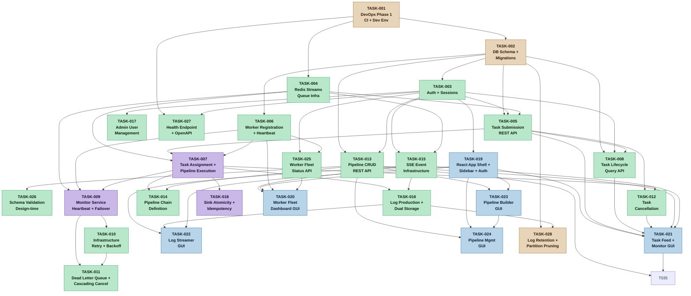
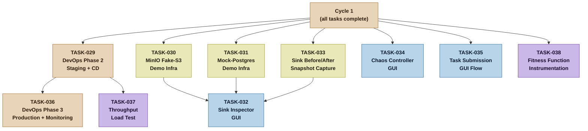

# Dependency Graph -- NexusFlow Task Plan
**Version:** 1 | **Date:** 2026-03-26

## Cycle 1 -- Walking Skeleton + Core System



## Cycle 2 -- Demo Infrastructure + Production Readiness



## Legend

| Color | Category |
|---|---|
| Orange | Infrastructure / DevOps |
| Green | Backend services |
| Blue | Frontend / GUI |
| Purple | Critical path / high-risk |
| Yellow | Demo infrastructure |

## Critical Path (Walking Skeleton)

The walking skeleton critical path through Cycle 1 is:

```
TASK-001 (DevOps) -> TASK-002 (DB Schema) -> TASK-003 (Auth)
                  -> TASK-004 (Redis Streams)
                                             -> TASK-005 (Task Submission API)
                  -> TASK-006 (Worker Registration)
                                             -> TASK-007 (Pipeline Execution)
                                             -> TASK-009 (Monitor/Failover)
```

This chain produces the walking skeleton: a user can authenticate, submit a task, have it queued, assigned to a worker, executed through a pipeline, and observe the result -- with auto-failover if the worker goes down.
