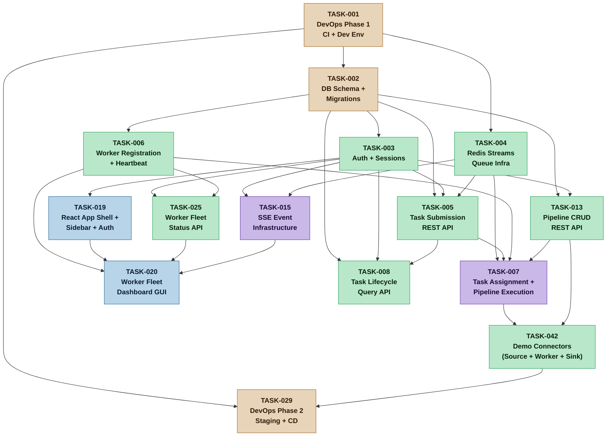
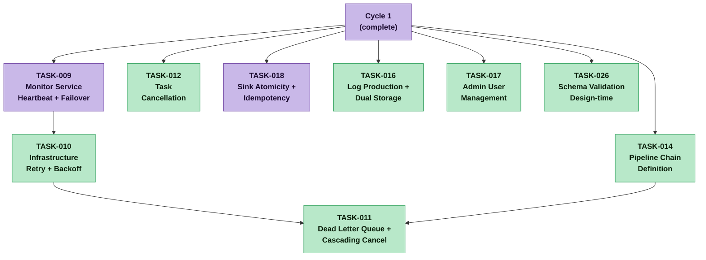
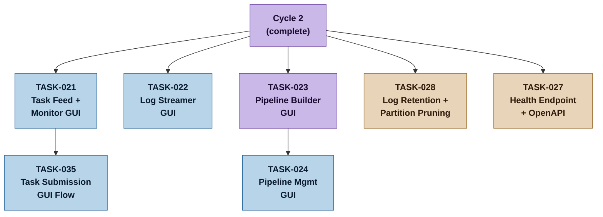
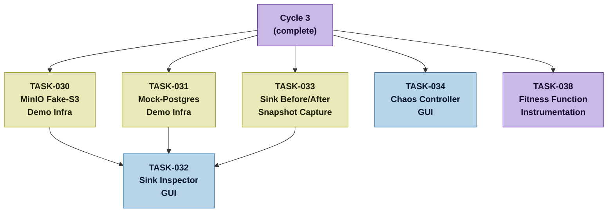
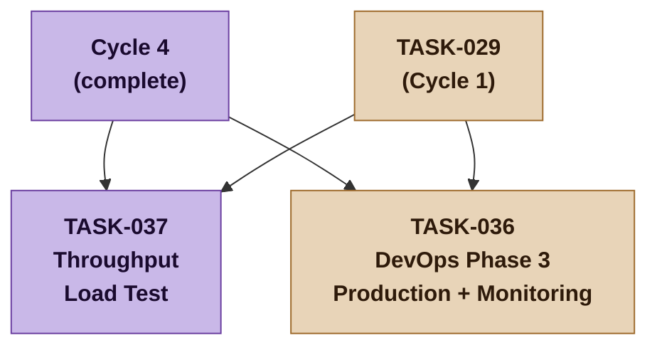

# Dependency Graph -- NexusFlow Task Plan
**Version:** 2.2 | **Date:** 2026-03-27

## Cycle 1 -- MVP Walking Skeleton



## Cycle 2 -- Core System Completion



## Cycle 3 -- GUI Completion and Infrastructure



## Cycle 4 -- Demo Infrastructure



## Cycle 5 -- Production Deployment



## Legend

| Color | Category |
|---|---|
| Orange | Infrastructure / DevOps |
| Green | Backend services |
| Blue | Frontend / GUI |
| Purple | Critical path / high-risk |
| Yellow | Demo infrastructure |

## Critical Path (Walking Skeleton -- Cycle 1)

The walking skeleton critical path through Cycle 1:

```
TASK-001 (DevOps) -> TASK-002 (DB Schema) -> TASK-003 (Auth)
                  -> TASK-004 (Redis Streams)
                                             -> TASK-005 (Task Submission API)
                  -> TASK-006 (Worker Registration)
                  -> TASK-013 (Pipeline CRUD API)
                                             -> TASK-007 (Pipeline Execution)
                                             -> TASK-042 (Demo Connectors)
```

This chain produces the walking skeleton: an admin can log in, create a demo pipeline via API, submit a task, have it queued, assigned to a simulated worker, executed through a three-phase pipeline with demo connectors, and see the task reach "completed" state. TASK-029 (staging deployment) depends on TASK-001 + TASK-042 and deploys the walking skeleton to nexusflow.staging.nxlabs.cc.

## Critical Path (Full v1.0.0 -- Cycles 1 through 3)

```
Cycle 1 -> TASK-009 (Monitor) -> TASK-010 (Retry) -> TASK-011 (DLQ)
        -> TASK-018 (Sink Atomicity)
        -> TASK-016 (Log Production)
        -> TASK-008 (Task Query API, Cycle 1) -> TASK-021 (Task Feed GUI) -> TASK-035 (GUI Submission)
        -> TASK-026 (Schema Validation) -> TASK-023 (Pipeline Builder) -> TASK-024 (Pipeline Mgmt)
```
